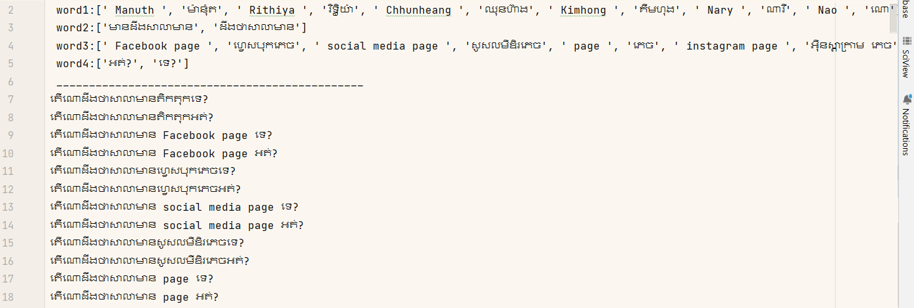
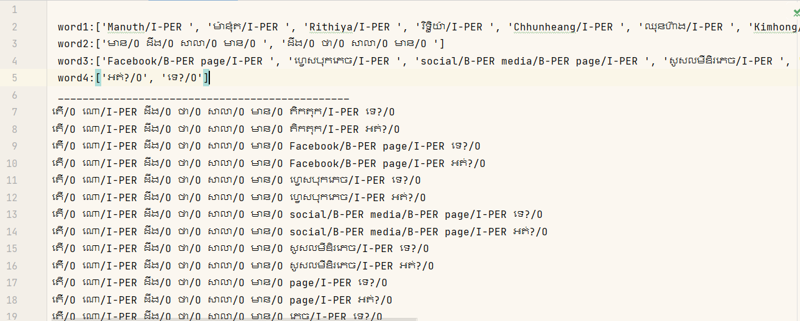

# Text-Augmentation
Text generating with the ability of Word Segmentation
```python
    filename = 'newPage'
    # If dak word normally, modify segment to false
    # If wants to segment word, add space to each word,
    # for Intent.I, adding space for entity is optional
    segment: bool = False

    words1 = convert(
        intent=Intent.I,
        segment=segment,
        words=[" Manuth ", "ម៉ាន៉ុត", " Rithiya ", "រិទ្ធិយ៉ា", " Chhunheang ", "ឈុនហ៊ាង",
               " Kimhong ", "គីមហុង", " Nary ",
               "ណារី", " Nao ", "ណោ"])

    words2 = convert(
        intent=Intent.O,
        segment=segment,
        words=["មាន ដឹង សាលា មាន ", "ដឹង ថា សាលា មាន "])

    words3 = convert(
        intent=Intent.I,
        segment=segment,
        words=[' Facebook page ', "ហ្វេសបុកភេច", " social media page ", "សូសលមីឌិរភេច", " page ",
               "ភេច",
               " instagram page ", "អុីនស្តាក្រាម ភេច", " Twitter ", "ថ្វីតធឺរ", " TikTok ",
               "តិកតុក"])

    words4 = convert(
        intent=Intent.O,
        segment=segment,
        words=["អត់?", "ទេ?"])

    sentences(filename, word1=words1, word2=words2, word3=words3, word4=words4, segment=segment)

```




To enable Word Segment:
- simply add True to the variable Segment
- add space to every word, Entity is optional:

```python
    segment: bool = True
```

Result:
